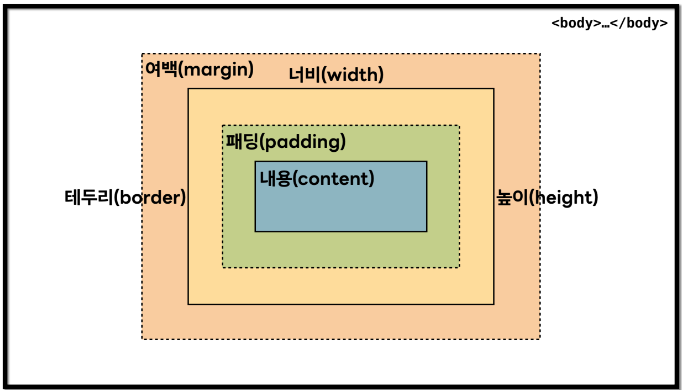

# css 작성방법 
## css와 hmtl 연결 방법 
    <link rel="stylesheet" href="./style.css"> : <head> 전에 작성하여 css와 html를 연결 시킨다 
## css를 통한 웹사이트 꾸미기 
### 색상 바꾸기 
    h1{color:색상;} :  h1을 "색상"의 컬러로 바꾼다 
       h1 말고 딴 html 요소의 색상 변경을 원할 시  = h1 대신 바꾸고 싶은 내용을 고르면 됨  
## 전체 적용 방법 
    *{하고 싶은 코딩} : 코딩 내용을 전체 적용
    ex) *{color: 색상;} : 전체가 "색상" 컬러로 바뀜

## div 활용법 
### div 인식
    
html의 코딩 내용
 : div 안에 있는 코딩 내용을 div 전체로 인식 
### div 색상 바꾸기     
     div{ color: 색상;} : div 안에 코딩 내용들이 "색상"의 컬러로 바뀜
### div 여백(margin) 설정  
     div{ margin: 숫자px;} : 상하좌우에 모든 같은 값을 적용 시킴 
     div{ margin: 숫자1px 숫자2px;} : 숫자1 = 상하, 숫자2= 좌우의 값을 적용시킴 
     div{ margin: 숫자1px 숫자2px 숫자3px 숫자4px } : 숫자1 = 상, 숫자2= 우, 숫자3= 하, 숫자4 = 좌의 값을 적용시킴

### div 테두리(border) 설정  
    div{border: 숫자px solid 색상;}  : 숫자px 두께의 실선 "색상"이 생김 
### div 패딩(padding) 설정 
    div{padding: 숫자px;} : 상하좌우에 모든 같은 값 적용 
    * div margin 설정의 상하좌우 형식과 동일
### div box에 적용된 사이즈 설정 
    div{box-sizing: content-box;} : 요소 사이즈에 패딩과 테두리 포함 x
    div{box-sizing: bonrder-box;} : 요소 사이즈에 패딩과 테두리 포함 0 
    
### div 내용 설정
    div{width: 숫자px;} : 총 너비 설정
    div{margin-left: auto;   
        margin-right: auto;} : 좌우 여백 균일하게 배포
    div{margin-left: 숫자px;} : 숫자px만큼 왼쪽으로 가기    
    div{margin-right: 숫자px;} : 숫자px만큼 오른쪽으로 가기 
        
    div{float: left;}  : 왼쪽에 블록박스 넣어내용을 맨 오른쪽으로 밀어버리는 설정
    div{float: right;} : 오른쪽에 블록박스 넣어 내용을 맨 왼쪽으로 밀어버리는 설정
    
## html에서 링크 연결 시 생기는 링크 효과 변경
    a {text-decoration-line: none;} : html에서 링크 연결 시 생기는 밑줄 제거
    a {text-decoration-line: underline;} : html에서 링크 연결 시 밑줄 생기게 설정 *기본값
    a {text-decoration-line: overline;} : html에서 링크 연결 시 글씨 위에 줄글 생기게 설정
    a {text-decoration-line: line-through;} : html에서 링크 연결 시 글씨 중간에 줄글 생기게 설정
    
    a:link{color: 색상;}    : 링크 연결 된 글씨 평소에 "색상"으로 적용
    a:visited{color: 색상;} : 링크 연결 된 글씨 방문 시 "색상"으로 적용
    a:hover{color: 색상;}   : 링크 연결 된 글씨 위에 마우스 시 "색상"으로 적용
    
 ## ul li 태그 가로로 배열
    ul{list-style: none;} : 목록 앞에 있는 기호들 제거 
    li{float: left;} : 가로로 정렬

 ## 움직이는 배너 설정
    .slider{ width: 숫자px;
             height: 숫자px;       : 사진 크기 설정
             position: relative;   : 요소를 원래 위치에서 벗어나 배치 할 수 있게 설정
            margin: 0 auto;       : 0으로 양쪽 다 균일하게 배열
            overflow: hidden;}    : html 요소 밖으로 삐져나오는 컨텐츠를 숨김 설정
            
    .slider input[type=radio]{display: none;} : 요소를 보이지 않게 설정
     ul.imgs{padding: 0; margin: 0; list-style: none;} : 이미지들 설정 후 점과 숫자 없애기
    .bullets{ position: absolute;          : 브라우저 화면 상에 어디든지 원하는 위치에 자유롭게 배치 가능하게 설정
              left: 50%;                   
              transform: translateX(숫자%);  : 요소의 표시 위치를 원하는 "숫자"만큼 이동 시
              bottom: 숫자px;                : 바닥과 숫자px만큼 떨어지게 설정
              z-index: 2;}                   : 요소의 수직 위치 정하는 설정 
              

 ## Inline box 와 Block box 이차이
    inline : 내가 쓴 내용까지만큼의 영역을 차지, margin과 padding만 적용 가능 
    block  : 페이지 한 줄 전체의 영역을 차지, 다 적용 가능(width,height,margin,padding)
    inline-block : inline과 block 특징을 모두 포함
                   줄을 바꾸지 않는다, 상하 margin,padding이 레이아웃에 유효 + width와           height 가짐  
    사용방법) .div{display: inline} : div 영역의 내용이 inline으로 변환 
             .div{display: block} : div 영역의 내용이 block으로 변환 
             
 ## FLex 설정(한 방향 레이아웃 시스템 1차원)
    부모 요소 = flex 컨테이너 
    자식 요소 = flex 아이템이라고 부름 
    .container {display: flex;} : Flex 컨테이너에 flex 적용
    
    <메인축>
	flex-direction: row; : 메인축의 방향이 가로 
	flex-direction: column; 메인축의 방향이 세로 
	flex-direction: row-reverse; : 메인 축의 방향이 가로인데 내용 순서가 c,b,a
	flex-direction: column-reverse; : 메인 축의 방향이 세로인데 내용 순서가 c,b,a
    
    <내용이 삐져나갔을 때>
	flex-wrap: nowrap; : 기본 값 
    flex-wrap: wrap;   : 줄바꿈을 함 
	flex-wrap: wrap-reverse;  : 줄바꿈을 하는데 내용 순서가 c,b,a
    
    <정렬>
    flex-direction: row; : 메인축 방향으로 정렬 
    flex-direction: wrap; : 수직축 방향으로 정렬 
    
    <메인축 방향 정렬> 
    justify-content: flex-start; : 아이템들을 시작점으로 정렬 
	justify-content: flex-end;   : 아이템들을 끝점으로 정렬 
    justify-content: center;     : 아이템들을 가운데로 정렬 
	justify-content: space-between; : 아이템들의 사이에 균일한 간격 만들어줌 
    justify-content: space-around;  : 아이템들의 둘레에 균일한 간격 만들어줌
	justify-content: space-evenly;  : 아이템들의 사이와 둘레에 균일한 간격 만들어줌 
    
    <수직축 방향 정렬> 
    align-items: stretch;    : 아이템들이 수직축 방향까지 끝까지 쭉 늘어남(기본값)
	align-items: flex-start; : 아이템들을 시작점으로 정렬 
	align-items: flex-end;   : 아이템들을 끝으로 정렬 
	align-items: center;     : 아이템들을 가운데로 정렬 
	align-items: baseline;   : 아이템들을 텍스트 베이스라인 기준으로 정렬 

   ## Grid 설정(가로-세로 두 방향 레이아웃 시스템 2차원)
      부모 요소 = Grid 컨테이너 
      자식 요소 = Grid 아이템이라고 부름 
      display: grid; : 컨테이너를 Grind로 설정 
      
      <컨테이너 영역에 grid 트랙 크키 설정>
      grid-template-columns: 1fr 1fr 1fr; : 1:1:1로 트랙 크키 설정 
      		      ex) 100px 2fr 1.5fr : 100px로 1:2:1.5로 트랙 크키 설정 
      *mainmax 함수 
      grid-template-rows: repeat(3, minmax(100px, auto)) : 내용이 아무리 적더라도 최소한 높이 100px은 확보하고(100px), 내용이 많아 넘어가면 알아서 늘어나도록 처리해줌(auto) 
      
     * auto-fill과 auto-fit
       auto-fill : 셀의 개수가 설정해둔 것보다 모자르면 공간이 남음 
       auto-fit  : 모자르더라도 남은 공간을 채움 
      
      <셀 사이 간격 설정> 
      row-gap: 숫자px;    : row의 간격을 숫자px로 
      column-gap: 숫자px; : column의 간격을 숫자px로 
      
      <영역 이름으로 그리드 정의>
      grid-template-areas:
		"header header header"
		"   a    main    b   "
		"   .     .      .   "
		"footer footer footer";
     * 각 셀마다 공백을 하나씩 넣어 구분, 빈칸은 마침표 또는 "none"을 사용 
     * 각 영역의 이름 매칭 : .header { grid-area: header; }
		            .sidebar-a { grid-area: a; }
                            .main-content { grid-area: main; }
                            .sidebar-b { grid-area: b; }
                            .footer { grid-area: footer; }
			    
       <세로축 방향 정렬 설정>
        align-items: stretch; : 기본 
	align-items: start;   : 시작점을 처음으로 정렬
	align-items: center;  : 가운데 정렬 
        align-items: end;     : 끝쪽으로 정렬 
	
	<가로축 방향 정렬 설정>
	justify-items: stretch; : 기본
	justify-items: start;   : 시작점을 기준으로 정렬
	justify-items: center;  : 중간으로 정렬 
	justify-items: end;     : 끝쪽으로 정렬 
	
	* 두개 동시에 쓸 수 있는 단축 속성: place-items
	
	<개별 아이템 세로축 방향 정렬>
	.item{ align-self: stretch;
	       align-self: start;
	       align-self: center;
	       align-self: end;
        <개별 아이템 가로축 방향 정렬>      
 	.item{ justify-self: stretch;
	       justify-self: start;
	      justify-self: center;
	      justify-self: end;
	       

## 웹페이지 각 기기마다 설정 또는 반응형 
    <각 기기마다 설정>
    media 이용 
    @media (min-width:200px) and (max-width:1000px) { font-size: 숫자px; } : 
    화면의 너비가 최소200px, 최대 1000px일 때, 글자 크기 숫자px로 설정 
    * 노트북 = 화면 너비가 0 ~ 960px 
    * 타블렛 = 화면 너비가 577 ~ 768px
    * 모바일 = 화면 너비가 0 ~ 576px
   
    <반응형>
    $(window).width(); : 전체 브라우저 화면의 너비를 실시간으로 가져옴 
   

